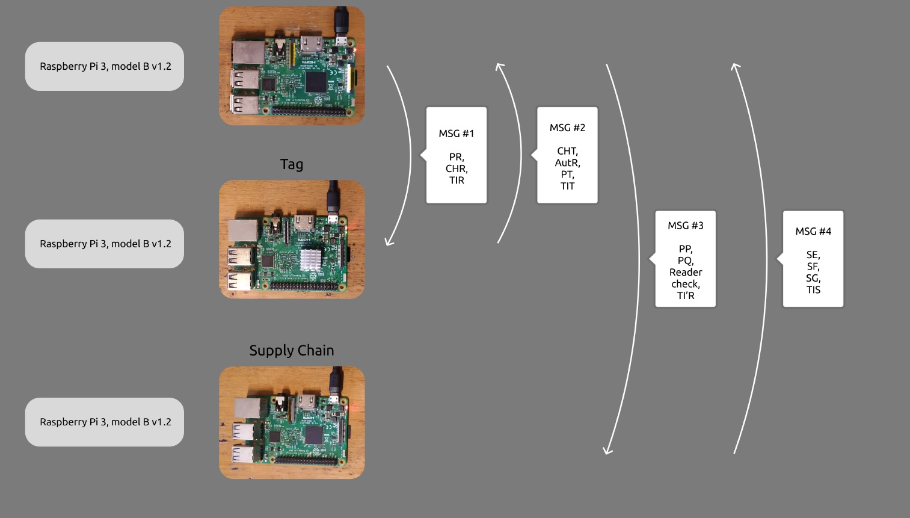
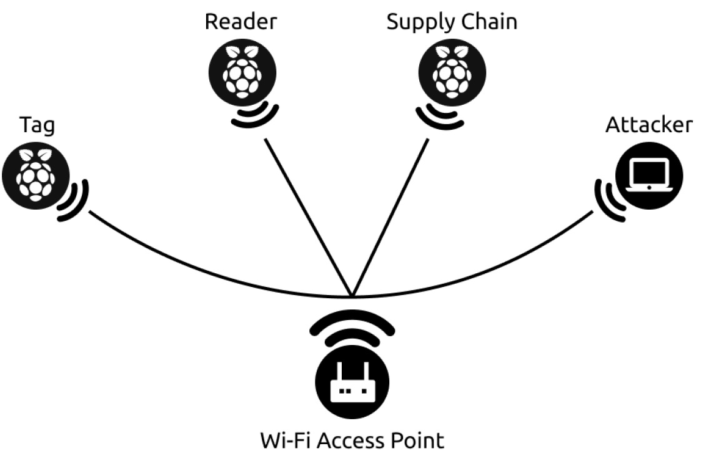
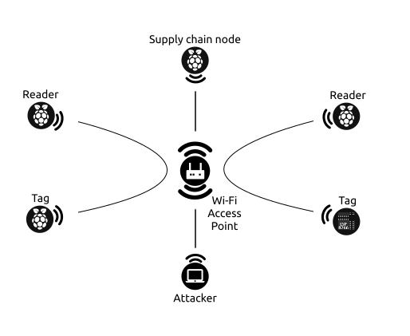
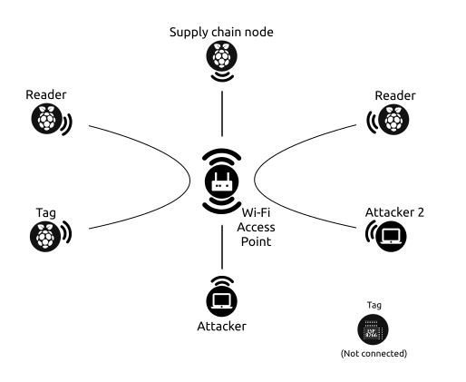

## Security Analysis of ”Ultra-Lightweight Blockchainenabled RFID Authentication Protocol for Supply Chain in the domain of 5G Mobile Edge Computing"
## Table of Contents
- [Overview](#overview)
- [Repository Structure](#repository-structure)
- [Algorithm](#algorithm)
- [Algorithm: Real Examples!](#algorithm-real-examples)
- [Contributions](#contributions)
- [Videos](#videos)

## Overview

An IoT-based supply chain system integrates various components, including RFID tags, readers, sensors, and communication networks, to streamline operations and enhance visibility. The structure typically includes tagged items (products), RFID readers, a central IoT platform, and data analytics tools. RFID tags store unique identification information and other relevant data, which they transmit wirelessly when queried by an RFID reader. RFID readers are placed at strategic points along the supply chain to scan RFID tags and collect data. Subsequently, the information is relayed to the central IoT platform via communication networks. In this system model, the RFID tags and readers facilitate real-time tracking, inventory management, and data collection, significantly improving efficiency and accuracy in supply chain operations.

<div align="center">
    
</div>

RFID security research is currently a significant focus globally, with numerous analysts dedicated to it. The adoption of RFID technology is gradually rising in the intelligence era. Consequently, various studies have expanded RFID applications in line with current social development and proposed security enhancement solutions. However, prevalent security threats, such as brute force attacks, remain significant.
## Repository Structure

The repository is organized as follows:

```plaintext
.
├── Algorithm.md
├── attack_example_one_session.md
├── attack_ulbraps_text.py
├── Code for each node
│   ├── attack.ipynb
│   ├── reader.ipynb
│   ├── supply.ipynb
│   └── tag.ipynb
├── Images
│   ├── IoT-based Supply Chain System.jpg
│   ├── Multi attacker skectch.svg
│   ├── Multi session sketch.svg
│   ├── Overall Attack Sketch.jpg
│   └── Protocol Messages.jpg
├── README.md
└── traceability_ulbraps.py
```


### [Code for each node](Code%20for%20each%20node)
The implementation code for the key recovery attacks, as detailed in subsections 'Secret Disclosure Attack' in the ULBRAP protocol, is written for each node (**[reader.ipynb](Code%20for%20each%20node/reader.ipynb)**, **[supply.ipynb](Code%20for%20each%20node/supply.ipynb)**, **[tag.ipynb](Code%20for%20each%20node/tag.ipynb)**) in Python.


### [Images](Images)
This directory holds image files used within the project.

- **[IoT-based Supply Chain System](Images/IoT-based-Supply-Chain-System.jpg)**: An IoT-based supply chain system integrates components: RFID tags, readers, sensors, and communication networks.

- **[Protocol Messages](Images/Protocol-Messages.jpg)**: Message transfer between nodes was facilitated using Python socket programming.
<div align="center">
    
</div>

- **[Overall One-session Attack Sketch](Images/Overall-Attack-Sketch.jpg)**: A comprehensive depiction of the attack on one session of the protocol, in multi session condition is presented in this figure.

- **[Overall Multi-session Attack Sketch](Images/Multi-session-sketch.svg)**: An overview of the multi session attack on the protocol is presented in this figure.

- **[Overall Multi-attacker Scenario Sketch](Images/Multi-attacker-skectch.svg)**: An overview of the multi attacker scenario of the protocol is presented in this figure.

### [attack_ulbraps_text.py](attack_ulbraps_text.py)
This code demonstrates secret disclosure attacks within an acceptable complexity threshold to retrieve the session key (TKST). As discussed in the paper, if the balance amount (BalN) is a secret parameter and represents a unique value for the target Tag, the ULBRAP protocol is vulnerable to desynchronization attacks. Consequently, in this implementation attack, we assume that the BalN is known within the network, highlighting the protocol's susceptibility to a secret disclosure attack.

### [traceability_ulbraps.py](traceability_ulbraps.py)
The process of identifying, capturing, and maintaining the records of all activities related to a particular event or transaction. In ULBRAP Protocol, The adversary could trace the result of XOR-ed identifiers of the tag (IDNT) and the supply chain node (IDNS) by eavesdropping on the messages sent in two sessions. MESG1 and MESG2 allow the attacker to obtain 161 candidate values for the result of XORing IDNT and IDNS. In the second session, with different timestamps and random values but the same identifiers for the Tag and Supply chain, we again have 161 possible candidates for the result of XOR-ed identifiers of the tag (IDNT) and the supply chain node (IDNS). By checking the intersection of these two lists, we can determine the actual value of the result of XOR-ed IDNT and IDNS.

## [Algorithm](Algorithm.md)
The session key $TK_{ST}$ recovery process consists of five main steps, detailed in the following [Algorithm](Algorithm.md).

## Algorithm: Real Examples!

This section presents real-world examples of different attack scenarios on the ULBRAP protocol, as listed below:

- One-session key recovery attack  
- Multi-session key recovery attack  
- Disrupting another attacker's scenario  

### One-Session Key Recovery Attack  

We have implemented a one-session key recovery attack on the ULBRAP protocol using actual values. A detailed description can be found [here](attack_example_one_session.md).  

- **[Overall One-Session Attack Sketch](Images/Overall-Attack-Sketch.jpg)**: This figure provides a comprehensive depiction of the attack on a single session of the protocol.  
<div align="center">
    
</div>

### Multi-Session Key Recovery Attack  

Furthermore, we took it a step further and applied the attack in a multi-session scenario involving two tags and readers connected within a single supply chain. You can access the video of this attack [here](https://drive.google.com/file/d/1FMMIb4HW9x1hVsUu5o3GAdY3WNu8TjGP/view?usp=sharing).  

<div align="center">
    
</div>

### Disrupting Another Attacker's Scenario (Multi attacker) 

Finally, we implemented a two-attacker scenario, where one attacker is active, and the other is passive. The active attacker sabotages the session key recovery process by impersonating tag #2 and sending a random string as message 2 in the ULBRAP protocol. This disrupts the protocol, causing it to stop and preventing the passive attacker from sniffing other messages. As a result, the passive attacker fails to recover the session key.  

The video of this scenario is available [here](https://drive.google.com/file/d/11tZvboCqF7LRLyAIHCPP_aw--3bzmfSx/view?usp=sharing).  

<div align="center">
    
</div>


## Contributions

- Security evaluation of ULBRAP protocol by Sanjeev Kumar et al. and prove its vulnerability against desynchronization and traceability attacks.
-  Practical implementation of the attack method to prove the functionality of the attack method.
-  Introduce a secure authentication protocol that is suitable for lightweight IoT devices in 5G communication networks to solve ULBRAP issues.

## Videos
A video demonstrating the one session attack and the process of finding the session key is available at this [link](https://drive.google.com/file/d/1HqF7aASL0UcmH0kUWEZ7a6mQCYXFKjQU/view?usp=drive_link).

Also, the multi session attack and multi attacker scenario videos is avaiable at [here: multi session](https://drive.google.com/file/d/1yjJi8FYsKF1CNI6vZsh2H2LMNqqXQ6QB/view?usp=drive_link), and [here: multi attacker](https://drive.google.com/file/d/1kY6uoUysAqtDgxW6Xf_cyZppeccyGYZB/view?usp=drive_link), respectively.
